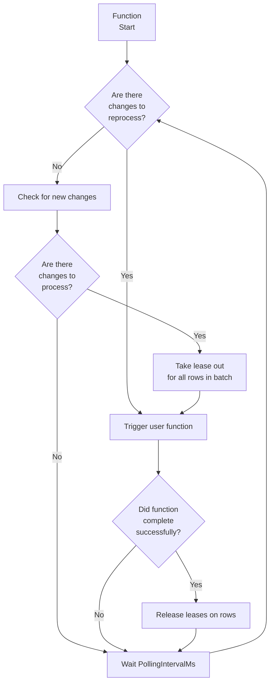
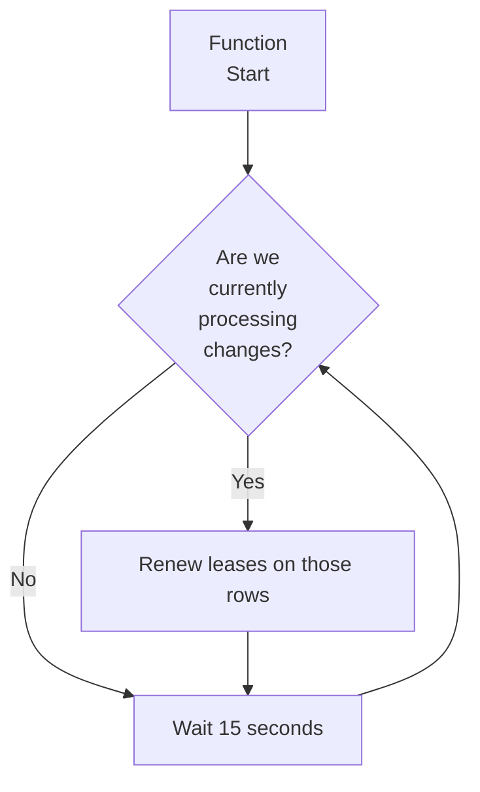

# Azure SQL Trigger Binding

This document will provide an in-depth explanation of the Azure SQL Trigger binding and how it's implemented.

## Functionality Overview

### Startup

When the function with the trigger is started, it will start up two separate loops that will run continuously until the function is stopped.

### Change Polling Loop

The change polling loop checks for changes on the target table, triggering the user function when changes are detected. At a high level the loop looks like this :

Changes are processed in the order that they were made, with the oldest changes being processed first. A couple notes about change processing:

1. If changes to multiple rows are made at once the exact order that they are sent to the function is based on the order returned by the CHANGETABLE function
2. Changes are "batched" together for a row. If multiple changes are made to a row between each iteration of the loop then only a single change entry exists for that row which will show the difference between the last processed state and the current state
3. If changes are made to a set of rows, and then another set of changes are made to half of those same rows, then the half of the rows that weren't changed a second time are processed first. This processing logic is due to the above note with the changes being batched - the trigger will only see the "last" change made and use that for the order it processes them in

For more information on change tracking and how it's used by applications such as Azure SQL triggers, see [Work with change tracking](https://learn.microsoft.com/sql/relational-databases/track-changes/work-with-change-tracking-sql-server) for more information on change tracking and how it is used by applications such as Azure SQL triggers.

#### Getting changed rows

When the trigger checks for changed rows it will return all rows (up to a maximum of `Sql_Trigger_MaxBatchSize`) that meet the following criteria. This uses the `CHANGETABLE` function to get the list of latest changes made to rows in the table and the [Leases](#internal-state-tables) table to keep track of whether a change has already been processed or whether it's currently being processed by another function instance.

* Null LeaseExpirationTime AND (Null ChangeVersion OR ChangeVersion < Current change version for that row from CHANGETABLE)

    OR

* LeaseExpirationTime < Current Time

This is because the lease expiration time is only ever set after it's picked up for processing by a function, and then when processing is completed it's set back to NULL. So a row that has a LeaseExpirationTime that has passed indicates that something went wrong with the original function that was processing it (such as a crash) and so should be considered as available for processing again.

### Lease Renewal Loop

"Leases" are used to mark rows as being currently handled by a function instance. This is an important feature for scalability purposes, as you may have multiple instances of a function all running in parallel and so leases are used to avoid multiple instances processing the same row at once.

When checking to determine if there are any changes available to process, any rows which are currently marked with a lease are ignored.

In order to avoid silently dropping rows if the function instance is shut down unexpectedly the leases have a duration (currently 60 seconds) - after which they will be included back in the query to fetch all available changes.

This can still result in double-processing rows though if a user function takes a long time to run (>60sec), since at that point the row lease will expire and another function instance may pick it up and start processing it itself. To avoid this, we use a separate "Lease Renewal" loop which will renew the leases on any rows currently being processed to ensure that as long as the function instance is still active no other instances will start processing that row.

At a high level this loop looks like this:

## Internal State Tables

The trigger functionality creates several tables to use for tracking the current state of the trigger. This allows state to be persisted across sessions and for multiple instances of a trigger binding to execute in parallel (for scaling purposes).

In addition, a schema named `az_func` will be created that the tables will belong to.

The login the trigger is configured to use must be given permissions to create these tables and schema. If not, then an error will be thrown and the trigger will fail to run.

If the tables are deleted or modified, then unexpected behavior may occur. To reset the state of the triggers, first stop all currently running functions with trigger bindings and then either truncate or delete the tables. The next time a function with a trigger binding is started, it will recreate the tables as necessary.

### az_func.GlobalState

This table stores information about each function being executed, what table that function is watching and what the [last sync state](https://learn.microsoft.com/sql/relational-databases/track-changes/work-with-change-tracking-sql-server) that has been processed.

### az_func.Leases_*

A `Leases_*` table is created for every unique instance of a function and table. The full name will be in the format `Leases_<FunctionId>_<TableId>` where `<FunctionId>` is generated from the function ID and `<TableId>` is the object ID of the table being tracked. Such as `Leases_7d12c06c6ddff24c_1845581613`.

To find the name of the leases table associated with your function, look in the log output for a line such as this which is emitted when the trigger is started.

`SQL trigger Leases table: [az_func].[Leases_84d975fca0f7441a_901578250]`

This log message is at the `Information` level, so make sure your log level is set correctly.

NOTE: `FunctionId` is generated from a couple of inputs:
    - The HostId, which is a hash of the assembly name containing the function
    - The full class and method name of the function

If either of these values are changed then a new FunctionId will be generated and result in the function starting over from the beginning, including creating a new Leases table.

This table is used to ensure that all changes are processed and that no change is processed more than once. This table consists of two groups of columns:

- A column for each column in the primary key of the target table - used to identify the row that it maps to in the target table
- A couple columns for tracking the state of each row. These are:
  - `_az_func_ChangeVersion` for the change version of the row currently being processed
  - `_az_func_AttemptCount` for tracking the number of times that a change has attempted to be processed to avoid getting stuck trying to process a change it's unable to handle
  - `_az_func_LeaseExpirationTime` for tracking when the lease on this row for a particular instance is set to expire. This ensures that if an instance exits unexpectedly another instance will be able to pick up and process any changes it had leases for after the expiration time has passed.

A row is created for every row in the target table that is modified. These are then cleaned up after the changes are processed for a set of changes corresponding to a change tracking sync version.
